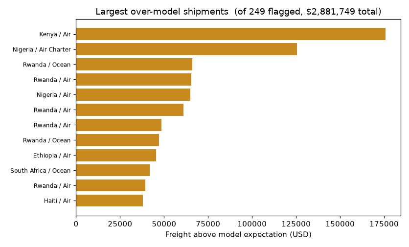

# Predicting Freight Shipping Costs in Global Health Supply Chains

Gradient boosting model predicting per-shipment freight cost for international health-commodity
deliveries (HIV/ARV, malaria diagnostics) shipped to 43 developing countries between 2006 and 2015.
Tuned model reaches **R² = 0.756** on held-out shipments (log scale; 0.603 on the raw dollar
scale), roughly double a ridge-regression baseline (R² = 0.354). Used as a screening tool, the
top 50 shipments the model flags as priced above expectation account for **$2.2M** in freight —
on donor-funded supply, a dollar-weighted worklist for contract review rather than a random
sample.



## Problem

Health-commodity procurement programs need to forecast freight costs during planning, before a
shipment is booked, to budget accurately and to catch shipments priced above what their
attributes justify. Freight cost is driven by a mix of route geography, urgency, shipment mode,
and vendor terms that aren't captured directly in the raw order data, so feature engineering
carries as much weight here as model selection.

## Data

Three public sources, joined into one modeling table (full citations, license terms, and usage
notes in `data/SOURCE.md`):

1. **[USAID Supply Chain Shipment Pricing Data](https://www.kaggle.com/datasets/princehobby/supply-chain-shipment-dataset)**
   — 10,324 health-commodity shipment records (HIV/ARV/malaria), 43 recipient countries,
   2006–2015. Originally published by USAID's Bureau for Global Health; archived and used here
   via its Kaggle mirror (also available at [data.gov](https://catalog.data.gov/dataset/supply-chain-shipment-pricing-data-fa4c8)).
   U.S. federal data, public domain.
2. **[Google country centroids](https://developers.google.com/public-data/docs/canonical/countries_csv)**
   — origin/destination lat-lon centroids, used to compute the `distance_km` haversine feature.
   Two shipment destinations (South Sudan, Congo-DRC) are missing from Google's file and were
   added manually. BSD-style license, redistribution permitted with attribution retained.
3. **EIA Gulf Coast spot fuel prices** — monthly jet-fuel and ultra-low-sulfur diesel spot prices,
   matched to each shipment by mode (jet fuel for air, diesel for truck, jet fuel as an ocean
   proxy), used as the `mode_fuel_price` macro cost covariate. Published by the U.S. Energy
   Information Administration. U.S. federal data, public domain.
   [Jet fuel](https://www.eia.gov/dnav/pet/hist/eer_epjk_pf4_rgc_dpgD.htm) ·
   [Diesel (ULSD)](https://www.eia.gov/dnav/pet/hist/eer_epd2dxl0_pf4_rgc_dpgD.htm)

All raw files are included in `data/` — see `data/SOURCE.md` for exact filenames, citations, and
the bundled Google license text.

## Approach

- **Target transform**: raw freight cost is heavily right-skewed (skew 4.69); a log1p transform
  brings it close to symmetric (skew -0.35), so the model is fit and primarily scored on the log
  scale, with dollar-scale metrics reported alongside for transparency.
- **Feature engineering**:
  - `distance_km` — parsed origin country from the free-text manufacturing site field (87.2%
    resolved), looked up origin/destination centroids, computed great-circle distance via the
    haversine formula. Single highest-value engineered feature; the raw data has no geography
    signal at all.
  - `mode_fuel_price` — monthly EIA spot price matched to each shipment's actual mode (jet fuel
    for air, diesel for truck, jet fuel as an ocean proxy), joined on shipment year-month.
- **Leakage avoidance**: pack price, unit price, and line-item value are algebraically linked
  (pack price = unit price × units-per-pack, ratio 1.000 confirmed) and were excluded as a cluster
  rather than left in as "extra predictors."
- **Modeling**: histogram-based gradient boosting (scikit-learn's `HistGradientBoostingRegressor`),
  tuned via 5-fold cross-validated grid search (best config: learning rate 0.1, 200 iterations, 31
  leaves), against a ridge-regression baseline (median-impute + standardize pipeline, alpha 7.85
  tuned by CV). Gradient boosting was the primary technique because freight cost depends on
  nonlinear, interacting factors a linear model can't represent, and it accepts missing distance
  and fuel values natively; ridge trades that accuracy for coefficient-level interpretability.
- **Statistical test**: Levene's test showed unequal variance across shipment modes (W = 96.6,
  p = 4.7e-61), so mode-level cost differences were tested with Welch's ANOVA rather than a
  classical F-test — result: F(3, 944) = 246.5, p < 0.001, freight cost differs significantly by
  mode (air and air-charter concentrate cost).
- **Validation**: 20% random holdout, confirmed by 5-fold CV (R² = 0.743) and by a temporal
  holdout (train through 2013, test 2014+) to get an honest deployment-realistic estimate.
- **Diagnostics**: permutation importance (shipment weight is the dominant driver, 0.78 share) and
  a Breusch-Pagan test on residuals, which rejects constant error variance (LM = 17.6,
  p = 2.7e-05) — error is proportionally larger for low-cost shipments.

## Results

| Model | Feature set | R² (log) | Adj. R² | R² (dollar) | MAE | Median APE |
|---|---|---|---|---|---|---|
| Gradient Boosting | Operational only | 0.734 | 0.732 | 0.545 | $5,117 | 35.6% |
| Gradient Boosting | + distance + fuel (enriched) | **0.756** | **0.753** | **0.603** | **$4,673** | **31.4%** |
| Ridge (baseline) | Operational only | 0.338 | 0.333 | 0.032 | $8,212 | 59.3% |
| Ridge (baseline) | + distance + fuel (enriched) | 0.354 | 0.347 | 0.071 | $8,096 | 58.1% |

Adjusted R² (holdout n = 1,240; k = 10 operational-only predictors, 14 enriched) barely moves off
raw R² -- with this much holdout data relative to predictor count, there's no meaningful
overfitting penalty from predictor count alone. Worth noting: this correction is an OLS concept
(it assumes each predictor spends one degree of freedom in a linear fit), so it's a standard,
informal convention for the gradient boosting rows here, not a rigorous statistical correction the
way it is for ridge. The notebook computes this from first principles in its final section, along
with the same figure for the two other model families it also fits (MLR, Gamma GLM).

Enrichment (distance + fuel) improves both model families, but the larger gap is between model
families — gradient boosting roughly doubles ridge's R² either way, confirming freight cost is
driven by nonlinear interactions a linear model can't capture. On a time-ordered holdout (train
through 2013, test 2014 onward) the enriched gradient boosting model's R² drops to 0.650 — still
strong, but the honest, decay-adjusted estimate of deployment performance versus the random-split
0.756.

**Business result**: scoring every shipment and ranking by (actual − predicted) freight surfaces a
prioritized worklist. The top 50 over-expectation shipments alone account for **$2,223,805** in
freight above the model's expectation — a dollar-weighted target for contract review instead of a
random audit sample.

## Limitations

- **Temporal decay**: accuracy falls from R² = 0.756 (random split) to 0.650 on a true
  out-of-period holdout; the model should be retrained periodically, not treated as static.
- **Dollar-scale precision**: the model is fit and best-scored on the log scale; back-transformed
  to dollars it explains less (R² = 0.603) because a handful of very large shipments dominate
  squared error. It's built for screening/ranking, not precise point-forecast dollar figures.
- **Non-constant error variance**: residual spread is widest for low-cost shipments (confirmed by
  a Breusch-Pagan test), so the smallest shipments' predictions are proportionally less reliable.
- **Excluded bundled freight**: about 40% of records carried text-coded freight ("Included in
  Commodity Cost," "Invoiced Separately") rather than a line-item dollar figure, and were dropped.
  The model doesn't represent shipments whose freight is bundled into commodity cost.
- **Tree models can't extrapolate**: gradient boosting predicts by averaging outcomes within
  learned feature regions, so a shipment heavier or farther than anything in the 2006–2015
  training data gets systematically under-predicted — a structural limit of the method, not just
  this dataset.

## Repo structure

```
supply-chain-freight-cost-prediction/
├── README.md
├── report/
│   └── Freight_Cost_Prediction_Findings.pdf    # full write-up
├── notebooks/
│   └── freight_cost_model.ipynb                # cleaning, feature engineering, modeling
├── data/
│   ├── Suppy_Chain_Shipment_Data.csv            # raw USAID SCMS shipment records
│   ├── countries_dspl_raw.csv                   # raw Google country centroids
│   ├── EIA_JetFuel_SpotPrice_GulfCoast.csv       # raw EIA jet fuel spot price
│   ├── EIA_Diesel_SpotPrice_GulfCoast_ULSD.csv   # raw EIA diesel spot price
│   ├── usaid_scored_output.csv                  # derived: holdout shipments w/ predicted vs
│   │                                            # actual freight, gap %, and worklist ranking
│   ├── SOURCE.md                                # citations, licenses, usage notes
│   └── LICENSE-google-dspl.txt                  # bundled per Google's redistribution terms
├── figures/                                    # 8 rendered charts (also embedded in the notebook)
├── metrics.json                                # every number this README and the paper cite
├── requirements.txt
├── .python-version
├── .gitignore
├── .gitattributes
└── LICENSE
```

## How to run

```bash
git clone git@github.com:jacobtrcook/supply-chain-freight-cost-prediction.git
cd supply-chain-freight-cost-prediction
pip install -r requirements.txt   # pinned to the exact versions the notebook was run with
jupyter notebook notebooks/freight_cost_model.ipynb
```

## License & attribution

Code in this repo is licensed under MIT (see `LICENSE`). All three underlying datasets are public
or open-license; see `data/SOURCE.md` for full citations and terms.

---

**Jacob Cook** · [GitHub](https://github.com/jacobtrcook)
